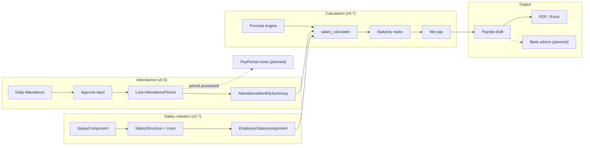
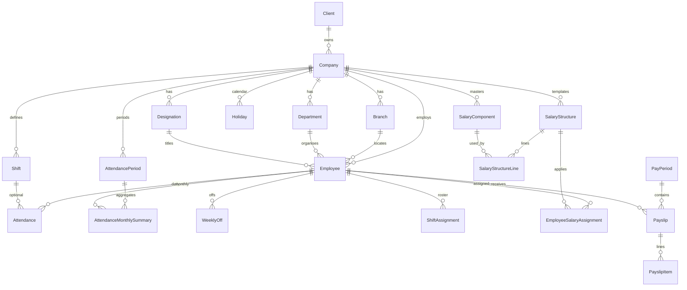
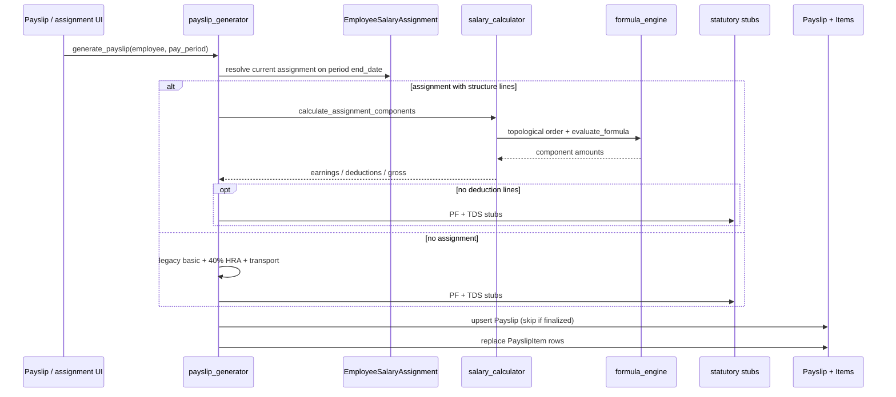
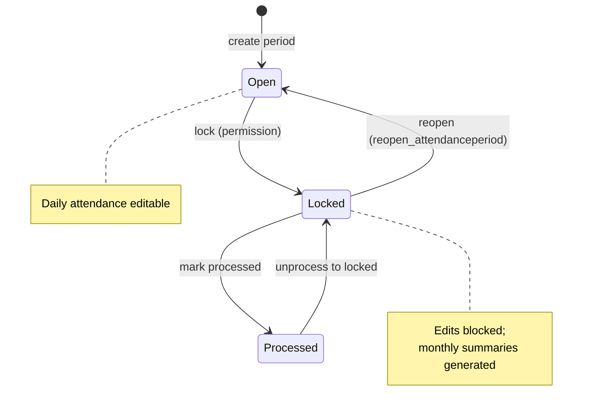

# PAS Architecture — Payroll Reference

Production-oriented reference for how PAS runs payroll today (v0.6–v0.7) and what is planned for v0.8+.

| Related docs | Path |
|--------------|------|
| SRS / stack | [01_SRS.md](01_SRS.md) |
| Schema detail | [02_DATABASE.md](02_DATABASE.md) |
| HTML URL map | [04_API.md](04_API.md) |
| Version history | [06_CHANGELOG.md](06_CHANGELOG.md) |
| Phased roadmap | [07_ROADMAP.md](07_ROADMAP.md) |
| Root mirror | [../../docs/ARCHITECTURE.md](../../docs/ARCHITECTURE.md) |

**Status legend**

| Tag | Meaning |
|-----|---------|
| **Implemented (v0.6–v0.7)** | Present in code on `main` (attendance Sprint 6, salary structures Sprint 7) |
| **Planned (v0.8+)** | Designed or stubbed; not yet production-complete |

---

## 1. Payroll lifecycle

End-to-end flow from attendance close through bank advice. Solid boxes are implemented; dashed boxes are planned.

### Step summary

| Step | Behaviour | Status |
|------|-----------|--------|
| 1. Attendance capture | Daily `Attendance` (P/A/H/WO/CL/SL/EL/LOP/HD/OD), shifts, holidays, import/export | **Implemented (v0.6)** |
| 2. Attendance approval | Per-row `approved` flag on daily attendance | **Implemented (v0.6)** — no multi-step workflow UI |
| 3. Period lock | `AttendancePeriod`: open → locked → processed; lock rebuilds monthly summaries | **Implemented (v0.6)** |
| 4. Salary assignment | Component masters → structure lines → `EmployeeSalaryAssignment` (effective dating) | **Implemented (v0.7)** |
| 5. Formula calculation | Safe AST formula engine + dependency order + rounding | **Implemented (v0.7)** |
| 6. Statutory | PF / ESI / PT / TDS helpers in `statutory.py` (stubs / simplified rates) | **Implemented (stubs)** — full engines **Planned (v0.8+)** |
| 7. Net → payslip | `generate_payslip` writes `Payslip` + `PayslipItem`; skips if `finalized` | **Implemented (v0.7)** |
| 8. Bank advice | Employee bank fields exist; dedicated NEFT/advice export | **Planned (v0.8+)** |
| 9. Pay period close | `PayPeriod.is_closed` exists; not enforced in generation UI | **Partial** — immutability goals **Planned (Sprint 8 / v0.8+)** |

**Note:** Payslip generation today does **not** yet prorate earnings from `AttendanceMonthlySummary` (LOP/OT). Summaries are the payroll feed for that work; wiring is **Planned (v0.8+)**.

---

## 2. Database relationships

Canonical hierarchy and payroll entities. Table/column detail: [02_DATABASE.md](02_DATABASE.md).

### Org & people

| Entity | App | Role |
|--------|-----|------|
| `Client` | `clients` | Top-level tenant |
| `Company` | `company` | Legal employer; statutory codes (EPF/ESI/PT) |
| `Branch` / `Department` / `Designation` | `company` | Org structure |
| `Employee` | `employee` | Worker; bank (`bank_account_number`, `ifsc_code`), `basic_salary` (legacy sync) |

### Attendance (v0.6)

| Entity | Scope | Notes |
|--------|-------|-------|
| `Shift`, `Holiday`, `AttendancePeriod` | Company | Period unique on `(company, month, year)` |
| `Attendance` | Employee + date | Unique `(employee, attendance_date)`; `approved` bool |
| `WeeklyOff`, `ShiftAssignment` | Employee | Effective dating |
| `AttendanceMonthlySummary` | Employee + period | present / absent / leave / WO / holiday / HD / OT / late / LOP |

### Salary & payroll (v0.7)

| Entity | Scope | Notes |
|--------|-------|-------|
| `SalaryComponent` | Company | earning / deduction / employer_contribution; fixed / % / formula |
| `SalaryStructure` + `SalaryStructureLine` | Company | Line can override calc type, value, %, formula |
| `EmployeeSalaryAssignment` | Employee | `effective_from` / `effective_to`; closes prior open assignment |
| `PayPeriod` | Global (year+month) | `is_closed` flag |
| `Payslip` / `PayslipItem` | Employee + period | Status `draft` / `finalized`; unique `(employee, pay_period)` |

**Legacy:** `employee.SalaryStructure` (basic/HRA%/transport template) remains for older paths; Sprint 7 masters in `apps.payroll` are the component engine.

---

## 3. Calculation sequence

Service package: `apps/payroll/services/`.

### Engines

| Module | Responsibility | Status |
|--------|----------------|--------|
| `formula_engine.py` | Safe AST eval (`+ - * / % **`); aliases (BASIC, HRA, GROSS…); cycle detection; no `eval`/`exec` | **Implemented (v0.7)** |
| `salary_calculator.py` | Line specs → dependency order → fixed / % of gross / formula → rounding → gross/CTC totals | **Implemented (v0.7)** |
| `statutory.py` | EE/ER PF, ESI, PT slab stub, TDS stub; `statutory_summary()` | **Stubs (v0.7)** — full TDS/PT **Planned (v0.8+)** |
| `payslip_generator.py` | Assignment-aware path or legacy; draft rewrite; finalized immutable | **Implemented (v0.7)** |
| `validation.py` | Structure/component validation helpers | **Implemented (v0.7)** |

### Net pay (current)

\[
\text{net} = \text{gross} - \sum \text{deduction items}
\]

Gross comes from assignment `gross_salary` (structure path) or legacy basic+HRA+transport. Employer contributions are calculated in the structure engine for CTC but are not stored as payslip earnings.

---

## 4. Approval workflow

### Attendance (v0.6) — **Implemented**

| Concern | Current behaviour |
|---------|-------------------|
| Day approval | `Attendance.approved` boolean (CRUD / import) |
| Period transition | `POST …/attendance/periods/<id>/transition/` via `transition_period()` |
| Lock side effect | `generate_monthly_summaries(period)` |
| Reopen | Requires `attendance.reopen_attendanceperiod` |

### Payslips — **Partial**

| Concern | Current behaviour | Planned |
|---------|-------------------|---------|
| Status | Model: `draft` / `finalized` | Approval UI / role gates |
| Regenerate | Rewrites draft; **skips** if finalized | Explicit finalize + reopen for payroll admin |
| PayPeriod | `is_closed` on model | Enforce close after bank advice |

There is **no** multi-step payslip approval chain in the HTML UI yet (see [07_ROADMAP.md](07_ROADMAP.md) Phase 2).

---

## 5. Locking rules

### Attendance period lock — **Implemented (v0.6)**

| Rule | Detail |
|------|--------|
| Editable when | `AttendancePeriod.status == open` |
| Blocked when | `locked` or `processed` — `assert_period_editable()` raises on create/edit/import |
| Allowed transitions | open↔locked, locked→processed, processed→locked |
| Reopen | locked→open only with `reopen_attendanceperiod` |
| Summary | Regenerated on lock |

### Payroll immutability — **Planned (Sprint 8 / v0.8+)** goals

| Goal | Today | Target |
|------|-------|--------|
| Finalized payslip | Not overwritten by `generate_payslip` | Keep; add UI finalize + audit |
| Closed pay period | `is_closed` unused in generator | Block regenerate / edits when closed |
| Attendance → payroll | Summaries not yet applied to pay | After period `processed`, freeze LOP/OT inputs into run |
| Correction path | Re-generate draft | Controlled reopen + correction payslip / arrears |

---

## 6. Extension points

Hooks and natural seams for upcoming features. Prefer new services under `apps/payroll/services/` (or dedicated apps) rather than hardcoding in views.

| Extension | Suggested seam | Status |
|-----------|----------------|--------|
| **Bonus / incentive** | `SalaryComponent` codes + formula refs (`BONUS`, `INCENTIVE` aliases already in formula engine) | Component-ready; run-time variable inputs **Planned** |
| **Arrears** | New earning items or adjustment payslip linked to prior `PayPeriod` | Alias `ARREARS` reserved; workflow **Planned** |
| **Loans / advances** | Deduction components or `Loan` model → installment `PayslipItem` | Roadmap Phase 4 |
| **Reimbursements** | Claim → approved amount → earning/non-taxable line | **Planned** |
| **Biometric / device import** | Attendance import pipeline (`import_export.py`) + shift resolution | Excel import **Implemented**; device APIs **Planned** |
| **Full TDS engine** | Replace `calculate_tds` stub; regime, declarations, Form 16 | **Planned (v0.8+)** |
| **Full PT engine** | Replace `calculate_professional_tax`; state slabs from company.state | **Planned (v0.8+)** |
| **PF / ESI compliance** | Wage ceilings, eligibility, ECR / returns from company codes | Stubs only; Phase 3 roadmap |
| **Bank advice** | Query finalized payslips + employee IFSC/account → NEFT Excel | Fields on employee; export **Planned** |
| **Attendance-linked pay** | Feed `AttendanceMonthlySummary.lop_days` / OT into calculator | Summaries **Implemented**; pay wiring **Planned** |

---

## 7. Code map (quick reference)

| Area | Location |
|------|----------|
| Attendance models / lock | `apps/attendance/models.py`, `apps/attendance/services.py` |
| Payroll models | `apps/payroll/models.py` |
| Formula / salary / payslip / statutory | `apps/payroll/services/*.py` |
| Payroll HTML routes | `apps/payroll/urls.py` → [04_API.md](04_API.md) |
| Attendance HTML routes | `apps/attendance/urls.py` |
| Org hierarchy | `apps/clients`, `apps/company`, `apps/employee` |

---

## 8. Version alignment

| Version | Theme |
|---------|-------|
| **v0.6** | Attendance management, period lock, monthly summary |
| **v0.7** | Component salary structures, formula engine, assignment-aware payslips, statutory stubs |
| **v0.8+** | Attendance-linked payroll, payroll period immutability, bank advice, full statutory engines, payslip approval UX |
|
