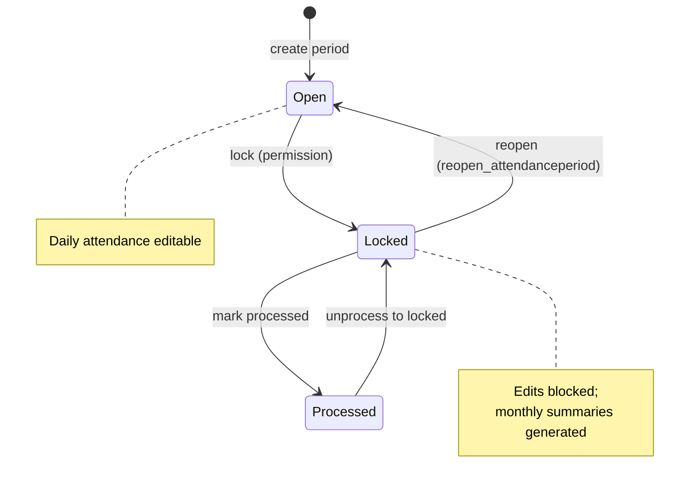

# Approval workflow

> Part of [PAS Architecture](../ARCHITECTURE.md). Status tags: **Implemented** vs **Planned**.

### Attendance (v0.6) — **Implemented**

| Concern | Current behaviour |
|---------|-------------------|
| Day approval | `Attendance.approved` boolean (CRUD / import) |
| Period transition | `POST …/attendance/periods/<id>/transition/` via `transition_period()` |
| Lock side effect | `generate_monthly_summaries(period)` |
| Reopen | Requires `attendance.reopen_attendanceperiod` |

### Payslips — **Partial**

| Concern | Current behaviour | Planned |
|---------|-------------------|---------|
| Status | Model: `draft` / `finalized` | Approval UI / role gates |
| Regenerate | Rewrites draft; **skips** if finalized | Explicit finalize + reopen for payroll admin |
| PayPeriod | `is_closed` on model | Enforce close after bank advice |

There is **no** multi-step payslip approval chain in the HTML UI yet (see [07_ROADMAP.md](../../backend/docs/07_ROADMAP.md) Phase 2).

### Related

- [Locking rules](locking-rules.md)
- [Payroll lifecycle](lifecycle.md)
|
