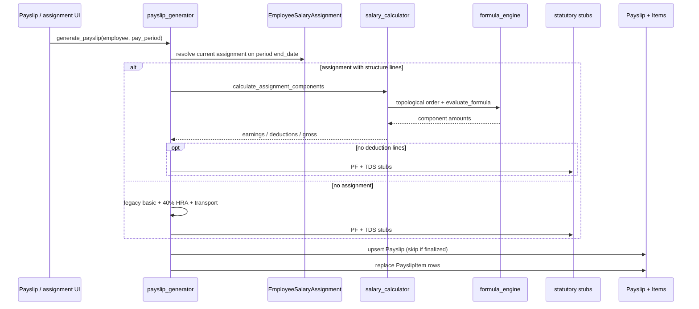

# Calculation sequence

> Part of [PAS Architecture](../ARCHITECTURE.md). Status tags: **Implemented** vs **Planned**.

Service package: `apps/payroll/services/`.

## Payroll run engine (Sprint 8.2)

```mermaid
sequenceDiagram
  participant UI as Run detail UI
  participant Eng as payroll_engine.calculate_run
  participant Att as attendance_loader
  participant Sal as salary_loader
  participant Calc as calculator
  participant FE as formula_engine / salary_calculator
  participant Snap as snapshot

  UI->>Eng: Calculate / Recalculate (Draft|Calculated|Incomplete)
  Eng->>Eng: reject if Locked / Reviewed / Approved
  Eng->>Eng: clear prior PayrollResult rows (atomic)
  loop each eligible employee
    Eng->>Att: attendance snapshot
    Eng->>Sal: effective salary assignment
    Eng->>Calc: full-month components + proration
    Calc->>FE: fixed / % / formula (no eval)
    Calc-->>Eng: EmployeeCalcResult
    alt success
      Eng->>Snap: PayrollResult + Components
    else controlled failure
      Eng->>Eng: savepoint rollback; record error (no zero pay)
    end
  end
  Eng->>Eng: status Calculated or Incomplete
```

### Proration basis

| Symbol | Meaning |
|--------|---------|
| `calendar_days` | Inclusive days in `PayrollPeriod` (`end − start + 1`) |
| `eligible_days` | Days on rolls in the period (`max(join, start)` … `min(exit\|end, end)`) |
| `payable_days` (with summary) | `present_days + paid_leave + WO + holiday` (half-day already **0.5** in `present_days`); capped at `eligible_days` |
| `payable_days` (no summary) | `max(0, eligible_days − lop_days)` (`lop_days` defaults to 0) |
| `proration_factor` | `payable_days / calendar_days` |

Earnings and structure deductions are evaluated at full monthly rates, then multiplied by `proration_factor`. Statutory PF/ESI/PT/TDS on run results are **`Decimal('0.00')` placeholders** until Sprint 9.

### Run status after calculation

| Outcome | Status | Results |
|---------|--------|---------|
| All employees succeed | `Calculated` | One `PayrollResult` per employee |
| One or more fail | `Incomplete` | Successful employees kept; failures listed in `calculation_errors` (no fake zero salary) |
| Locked / Reviewed / Approved | Rejected | Unchanged |

Recalculation of unlocked runs replaces previous results inside `transaction.atomic`.

---

## Legacy payslip path (v0.7)



### Engines

| Module | Responsibility | Status |
|--------|----------------|--------|
| `formula_engine.py` | Safe AST eval (`+ - * / % **`); aliases; cycle detection; no `eval`/`exec` | **Implemented (v0.7)** |
| `salary_calculator.py` | Line specs → dependency order → fixed / % / formula → rounding | **Implemented (v0.7)** |
| `calculator.py` / `payroll_engine.calculate_run` | Run pipeline, proration, snapshots, partial errors | **Implemented (v0.8.2 / Sprint 8.2)** |
| `attendance_loader.py` / `salary_loader.py` | Period attendance + effective assignment | **Implemented (Sprint 8.2)** |
| `statutory.py` | EE/ER PF, ESI, PT, TDS helpers | **Stubs** — full engines **Planned (Sprint 9)** |
| `payslip_generator.py` | Legacy payslip path | **Implemented (v0.7)** |
| `validation.py` | Structure / period / run calculable checks | **Implemented** |

### Net pay (run engine)

\[
\text{net} = \sum \text{prorated earnings} - \sum \text{prorated structure deductions} - 0_{\text{statutory placeholders}}
\]

### Related

- [Payroll lifecycle](lifecycle.md)
- [Data model](data-model.md)
- [Extension points](extension-points.md)
|