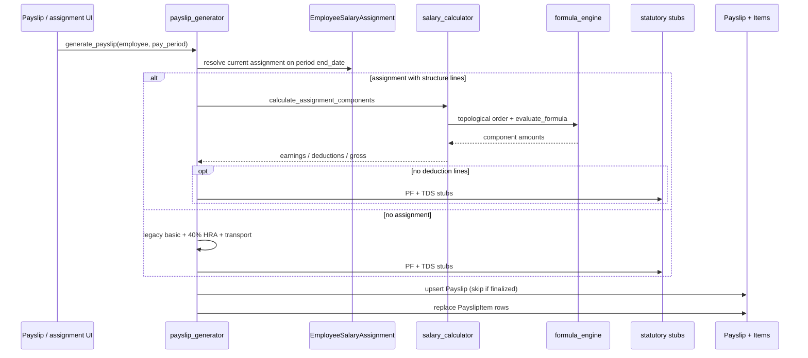

# Calculation sequence

> Part of [PAS Architecture](../ARCHITECTURE.md). Status tags: **Implemented** vs **Planned**.

Service package: `apps/payroll/services/`.

### Engines

| Module | Responsibility | Status |
|--------|----------------|--------|
| `formula_engine.py` | Safe AST eval (`+ - * / % **`); aliases (BASIC, HRA, GROSS…); cycle detection; no `eval`/`exec` | **Implemented (v0.7)** |
| `salary_calculator.py` | Line specs → dependency order → fixed / % of gross / formula → rounding → gross/CTC totals | **Implemented (v0.7)** |
| `statutory.py` | EE/ER PF, ESI, PT slab stub, TDS stub; `statutory_summary()` | **Stubs (v0.7)** — full TDS/PT **Planned (v0.8+)** |
| `payslip_generator.py` | Assignment-aware path or legacy; draft rewrite; finalized immutable | **Implemented (v0.7)** |
| `validation.py` | Structure/component validation helpers | **Implemented (v0.7)** |

### Net pay (current)

\[
\text{net} = \text{gross} - \sum \text{deduction items}
\]

Gross comes from assignment `gross_salary` (structure path) or legacy basic+HRA+transport. Employer contributions are calculated in the structure engine for CTC but are not stored as payslip earnings.

### Related

- [Payroll lifecycle](lifecycle.md)
- [Data model](data-model.md)
- [Extension points](extension-points.md)
|
