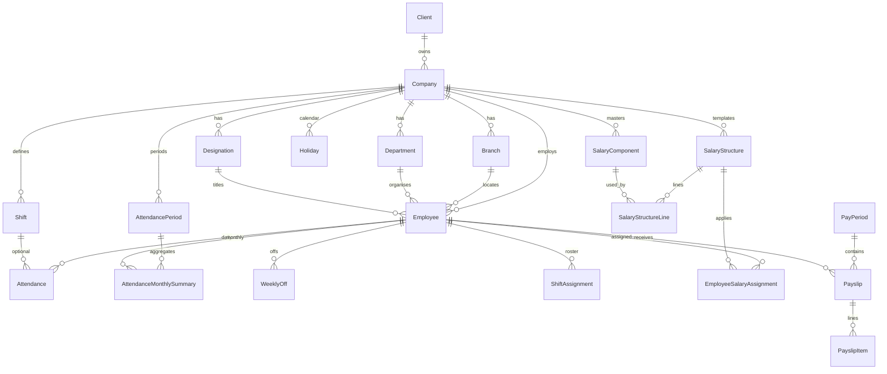

# Data model

> Part of [PAS Architecture](../ARCHITECTURE.md). Status tags: **Implemented** vs **Planned**.

Canonical hierarchy and payroll entities. Table/column detail: [02_DATABASE.md](../../backend/docs/02_DATABASE.md).

### Org & people

| Entity | App | Role |
|--------|-----|------|
| `Client` | `clients` | Top-level tenant |
| `Company` | `company` | Legal employer; statutory codes (EPF/ESI/PT) |
| `Branch` / `Department` / `Designation` | `company` | Org structure |
| `Employee` | `employee` | Worker; bank (`bank_account_number`, `ifsc_code`), `basic_salary` (legacy sync) |

### Attendance (v0.6)

| Entity | Scope | Notes |
|--------|-------|-------|
| `Shift`, `Holiday`, `AttendancePeriod` | Company | Period unique on `(company, month, year)` |
| `Attendance` | Employee + date | Unique `(employee, attendance_date)`; `approved` bool |
| `WeeklyOff`, `ShiftAssignment` | Employee | Effective dating |
| `AttendanceMonthlySummary` | Employee + period | present / absent / leave / WO / holiday / HD / OT / late / LOP |

### Salary & payroll (v0.7)

| Entity | Scope | Notes |
|--------|-------|-------|
| `SalaryComponent` | Company | earning / deduction / employer_contribution; fixed / % / formula |
| `SalaryStructure` + `SalaryStructureLine` | Company | Line can override calc type, value, %, formula |
| `EmployeeSalaryAssignment` | Employee | `effective_from` / `effective_to`; closes prior open assignment |
| `PayPeriod` | Global (year+month) | `is_closed` flag |
| `Payslip` / `PayslipItem` | Employee + period | Status `draft` / `finalized`; unique `(employee, pay_period)` |

**Legacy:** `employee.SalaryStructure` (basic/HRA%/transport template) remains for older paths; Sprint 7 masters in `apps.payroll` are the component engine.

### Related

- [Calculation sequence](calculation-sequence.md)
- [Locking rules](locking-rules.md)
|
