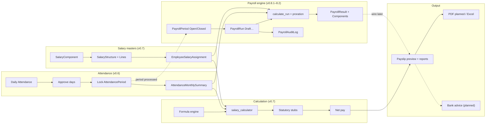

# Payroll lifecycle

> Part of [PAS Architecture](../ARCHITECTURE.md). Status tags: **Implemented** vs **Planned**.

End-to-end flow from attendance close through bank advice. Solid boxes are implemented; dashed boxes are planned.

### Step summary

| Step | Behaviour | Status |
|------|-----------|--------|
| 1. Attendance capture | Daily `Attendance` (P/A/H/WO/CL/SL/EL/LOP/HD/OD), shifts, holidays, import/export | **Implemented (v0.6)** |
| 2. Attendance approval | Per-row `approved` flag on daily attendance | **Implemented (v0.6)** — no multi-step workflow UI |
| 3. Period lock | `AttendancePeriod`: open → locked → processed; lock rebuilds monthly summaries | **Implemented (v0.6)** |
| 4. Salary assignment | Component masters → structure lines → `EmployeeSalaryAssignment` (effective dating) | **Implemented (v0.7)** |
| 5. Formula calculation | Safe AST formula engine + dependency order + rounding | **Implemented (v0.7)** |
| 6. Statutory | `compliance.pf_engine` + `statutory.py` bridges | **EPF Implemented (Sprint 9.1)**; ESI/PT/TDS **Planned (9.2–9.4)** |
| 7. Net → payslip | `generate_payslip` writes `Payslip` + `PayslipItem`; skips if `finalized` | **Implemented (v0.7)** |
| 8. Bank advice | Employee bank fields exist; dedicated NEFT/advice export | **Planned (v0.8+)** |
| 9. Payroll period / run foundation | `PayrollPeriod` (Open/Closed, overlap checks), `PayrollRun` (Draft+status scaffold), `PayrollResult` / `PayrollResultComponent`, `PayrollAuditLog`; services under `apps/payroll/services/` | **Implemented (v0.8.1 foundation)** |
| 10. Run calculation | `calculate_run`: attendance + effective assignment + formula + proration → results; Incomplete on per-employee errors; recalculate unlocked | **Implemented (Sprint 8.2)** |
| 11. Approval / lock | Reviewed → Approved → Locked immutability | **Implemented (Sprint 8.3)** |
| 12. Reports / payslip preparation | Snapshot-only on-screen payroll reports, Excel exports, and draft/final payslip preview; PDF rendering remains deferred | **Implemented (Sprint 8.4)** |

**Legacy:** `PayPeriod` / `Payslip` remain for existing payslip generation. `PayrollPeriod` / `PayrollRun` snapshots now supply report and preview data; PDF generation remains planned.

**Proration (Sprint 8.2):** calendar days in period vs payable days (eligible days after mid-month join / exit; LOP; half-day = 0.5 present). See [calculation-sequence.md](calculation-sequence.md).

### Related

- [Calculation sequence](calculation-sequence.md)
- [Approval workflow](approval-workflow.md)
- [Locking rules](locking-rules.md)
|
