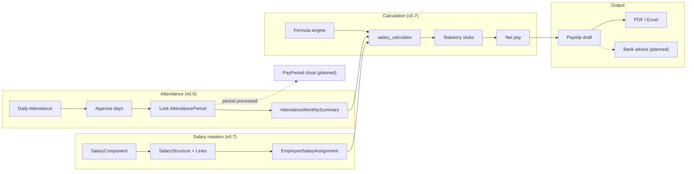

# Payroll lifecycle

> Part of [PAS Architecture](../ARCHITECTURE.md). Status tags: **Implemented** vs **Planned**.

End-to-end flow from attendance close through bank advice. Solid boxes are implemented; dashed boxes are planned.

### Step summary

| Step | Behaviour | Status |
|------|-----------|--------|
| 1. Attendance capture | Daily `Attendance` (P/A/H/WO/CL/SL/EL/LOP/HD/OD), shifts, holidays, import/export | **Implemented (v0.6)** |
| 2. Attendance approval | Per-row `approved` flag on daily attendance | **Implemented (v0.6)** — no multi-step workflow UI |
| 3. Period lock | `AttendancePeriod`: open → locked → processed; lock rebuilds monthly summaries | **Implemented (v0.6)** |
| 4. Salary assignment | Component masters → structure lines → `EmployeeSalaryAssignment` (effective dating) | **Implemented (v0.7)** |
| 5. Formula calculation | Safe AST formula engine + dependency order + rounding | **Implemented (v0.7)** |
| 6. Statutory | PF / ESI / PT / TDS helpers in `statutory.py` (stubs / simplified rates) | **Implemented (stubs)** — full engines **Planned (v0.8+)** |
| 7. Net → payslip | `generate_payslip` writes `Payslip` + `PayslipItem`; skips if `finalized` | **Implemented (v0.7)** |
| 8. Bank advice | Employee bank fields exist; dedicated NEFT/advice export | **Planned (v0.8+)** |
| 9. Pay period close | `PayPeriod.is_closed` exists; not enforced in generation UI | **Partial** — immutability goals **Planned (Sprint 8 / v0.8+)** |

**Note:** Payslip generation today does **not** yet prorate earnings from `AttendanceMonthlySummary` (LOP/OT). Summaries are the payroll feed for that work; wiring is **Planned (v0.8+)**.

### Related

- [Calculation sequence](calculation-sequence.md)
- [Approval workflow](approval-workflow.md)
- [Locking rules](locking-rules.md)
|
